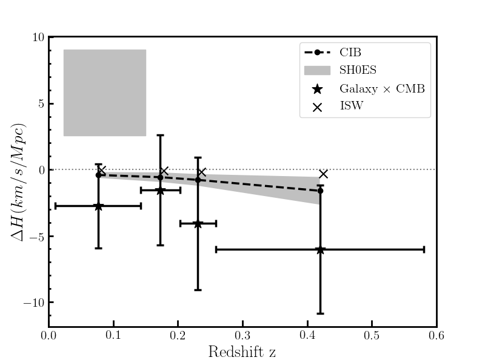
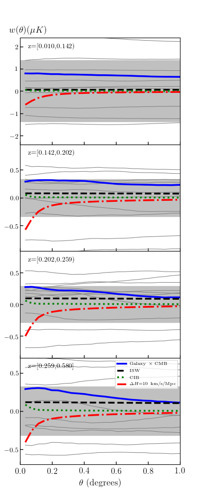

# Update: [paper draft on overleaf](https://www.overleaf.com/read/szngrhcfnshs)

# Update: Joshua Yao-Yu Lin and I are in the [strong lensing finding challenge 2.0.](http://metcalf1.difa.unibo.it/blf-portal/gg_challenge.html) We achieved a nearly perfect f_beta_score=0.9998 with machine learning! The repo for code is still private for now, will make it public after the challenge deadline.

# KSZ-cross-correlation-2019

In this project we study kSZ(kinematic Sunyaev–Zel'dovich) effect by cross correlate galaxy catalogs with tSZ-free CMB map. Based on that, we try to place constraints on the tension over Hubble constant if we live inside of a underdensed "local void", and hopefully, give hints to rule out that "local bubble theory".

**Data part:** SuperCosmos galaxy catalog X CMB

**Theory part:** Predict galaxy X CMB cross correlation function base on "local void" theories. i.e. we lives in a underdensed part of the universe.

**Purpose:** Compare data and theory to add some discussion on the on-going hot debate over **Hubble constant tension**. (Against local void)

Supervisor: [Prof. Gilbert Holder](https://physics.illinois.edu/people/directory/profile/gholder)

**This is project a almost done! We are formulating words for the Paper.**

**My first paper! Hooray!**

All y-errorbars are 2 sigmas

grey thin lines are SuperCosmos Galaxy X Planck CMB simulations
shaded is region is indicates the 1-sigma for simulations
