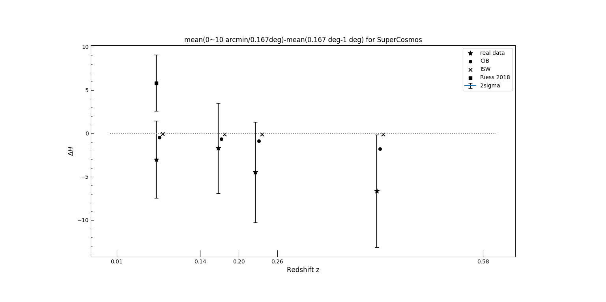

# KSZ-cross-correlation-2019

In this project we study kSZ(kinematic Sunyaev–Zel'dovich) effect by cross correlate galaxy catalogs with tSZ-free CMB map. Based on that, we try to place constraints on the tension over Hubble constant if we live inside of a underdensed "local void", and hopefully, give hints to rule out that "local bubble theory".

**Data part:** SuperCosmos galaxy catalog X CMB

**Theory part:** Predict galaxy X CMB cross correlation function base on "local void" theories. i.e. we lives in a underdensed part of the universe.

**Purpose:** Compare data and theory to add some discussion on the on-going hot debate over **Hubble constant tension**. (Against local void)

Supervisor: [Prof. Gilbert Holder](https://physics.illinois.edu/people/directory/profile/gholder)

**This is an on-going project! All results are not polished nicely yet.** Espeically the first plot presents the result in a werid way...

grey lines are Galaxy x CMB simulations.
I am still running sims x galaxy for the other two z bins which are missing

